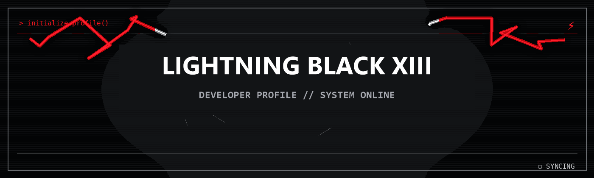
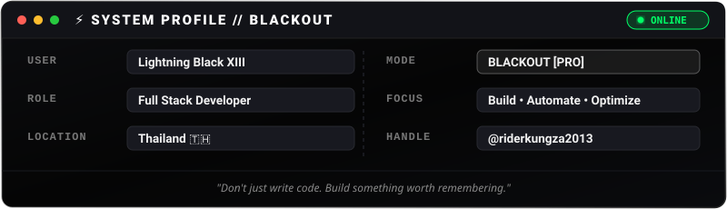
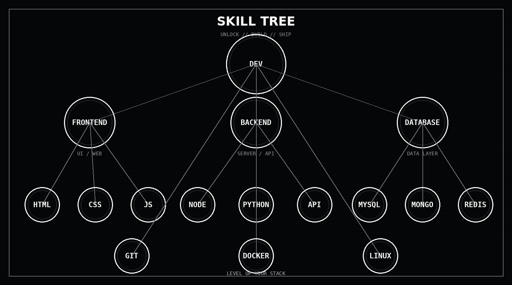
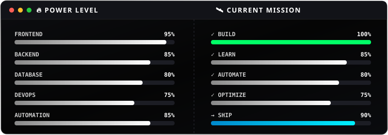
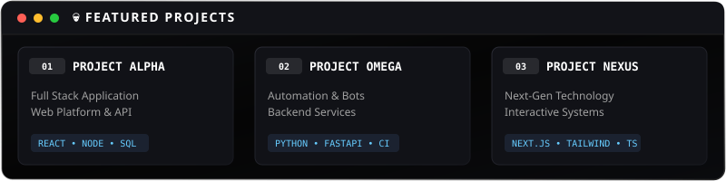

<!-- ========================================================= -->
<!--                    BLACKOUT HEADER                        -->
<!-- ========================================================= -->

### ⚡ SYSTEM PROFILE

  

---

### 🧬 SKILL TREE

  

---

### ⚔️ TECH STACK

  

---

### 🔥 POWER LEVEL &amp; CURRENT MISSION

  

---

### 💀 FEATURED PROJECTS

  

---

### 📊 GITHUB ANALYTICS

  
    
  
    
  

---

### 🐍 CONTRIBUTION GRAPH

  <picture>
    <source media="(prefers-color-scheme: dark)" srcset="https://raw.githubusercontent.com/riderkungza2013/riderkungza2013/output/github-contribution-grid-snake-dark.svg">
    <source media="(prefers-color-scheme: light)" srcset="https://raw.githubusercontent.com/riderkungza2013/riderkungza2013/output/github-contribution-grid-snake.svg">
    
  </picture>

---

### ⚡ ACTIVITY GRAPH

  

---

### 🕶️ CONNECT WITH ME

  
  &nbsp;
  
  &nbsp;
  

 

  ⚡ ───────────────────────────────────────────────────────────── ⚡
   
  <b>CODE. COMMIT. CONQUER.</b>
   
  ⚡ ───────────────────────────────────────────────────────────── ⚡
    
  

